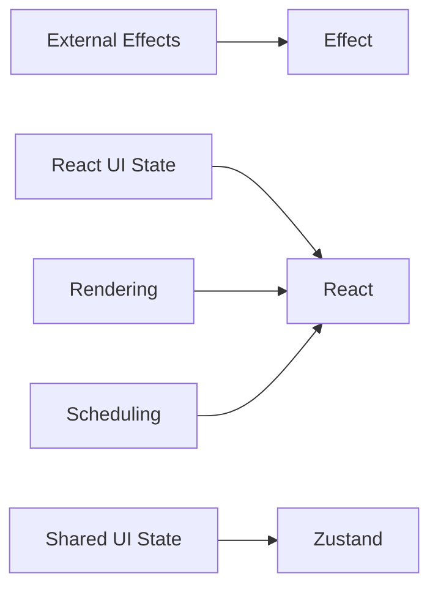
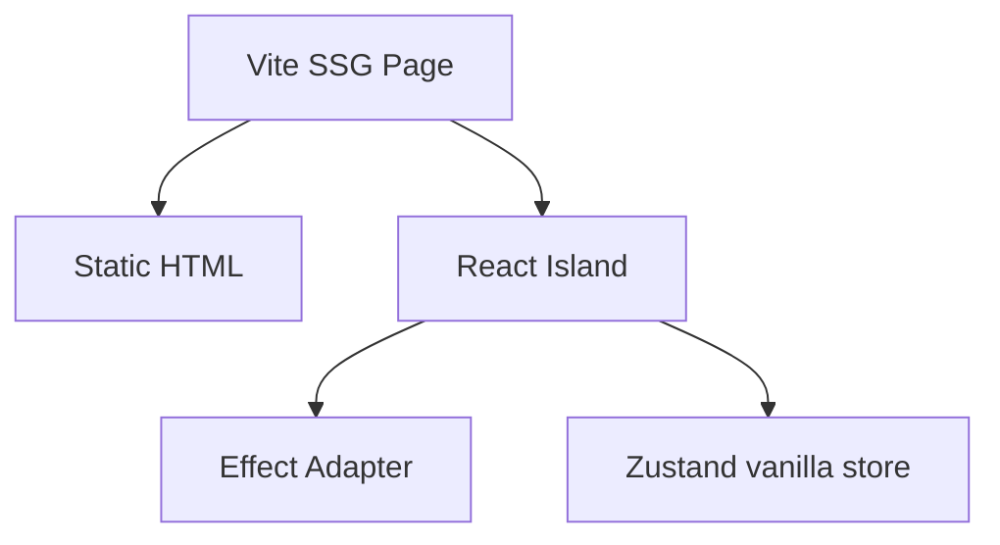
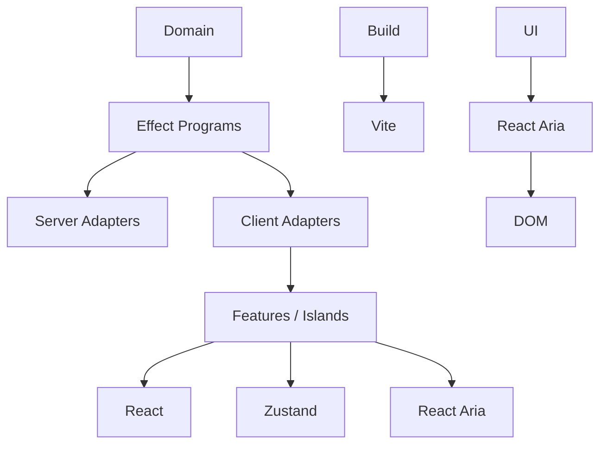

# 設計原則

## 1．責務を分ける

次の責務を同じ層に集めない．

$$ Computation \neq State \neq Rendering \neq Interaction \neq Presentation $$

| 層         | 担当する処理                                                                |
| ---------- | --------------------------------------------------------------------------- |
| Vite SSG   | Build-time routing，SSG，HTML Document，静的配信                            |
| Effect     | 非同期処理，依存性，エラー，Retry，Timeout，Cancellation，Resource Lifetime |
| Zustand    | 複数の独立した Island で共有する Mutable Client State                       |
| React      | Render，Suspense，Transition，Reconciliation，Commit                        |
| React Aria | Accessibility，Keyboard，Focus，Pointer，ARIA，Internationalization         |
| CSS        | 色，余白，Typography，Layout，Animation                                     |

## 2．Domain と UI を分離する

Domain Program は React，Vite，DB，R2，HTTP を直接 import しない．実行環境は Effect の Layer や Adapter で与える．

UI 層は Effect，API Client，application-specific type，domain-specific type を import しない．`UserId` のような domain primitive も禁止する．操作が必要な UI は React Aria を使い，Feature 層で domain type を UI 用の primitive または UI 専用 props に変換する．

React Component は DB や R2 に直接アクセスしない．SSG build の content adapter または明示的な Client Adapter を経由する．

## 3．状態の所有者を明確にする

外部作用を含む処理は，規模に関係なく Effect にする．React Component から直接 `fetch` や DB 呼び出しを実行しない．

React 固有の UI State と Rendering は React に任せる．Effect で React の State や Rendering を置き換えない．

### Effect に置くもの

- API 呼び出し
- Retry，Timeout，Cancellation
- 複数の処理を組み合わせた Workflow
- Domain Error
- Resource の取得と解放
- 小規模な API 呼び出しを含む，すべての外部作用

### Zustand に置くもの

- 選択中の項目
- Session や Workspace
- Cart
- 複数の React Island が共有する UI State

Zustand Store に Fetch，Retry，Cancellation，Workflow，API Cache を実装しない．React 固有の局所 UI State は Component Local State を使い，複数 Island 間で共有する場合だけ vanilla store を使う．

## 4．静的な HTML に React を読み込まない

Vite SSG はページ全体を HTML として生成する．React は static markup を基本とし，操作が必要な部分だけ client script / island として追加する．

記事本文，見出し，Metadata のようにブラウザ上の状態を必要としないものは，React Island にしない．

## 5．依存方向を固定する

次の依存を禁止する．

- Domain → React / Vite SSG
- `packages/blog-ui` → Effect / Zustand / API / Domain
- Zustand Store → Domain Workflow
- React Component → DB / R2
- Static HTML → Client Adapter

## 6．実験的な Adapter を必須にしない

Effect と Suspense / Transition を接続する Resource Adapter は，既存のブログ表示に必須ではない．導入する場合も，Markdown，ox-content，静的 HTML が成立した後に追加する．
