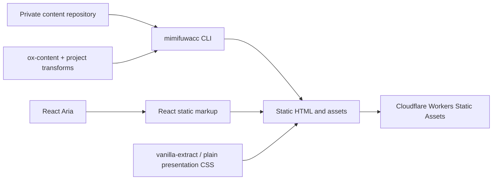

# Implementation Architecture

## Runtime boundary

The public site is a Vite/React static-site build. It does not fetch article
content at request time and it does not require an article API or an admin
application.



The build has one visibility boundary:

- local `preview` and `check` can read all articles from the private content
  repository;
- production `build` selects only `status: published`;
- generated output contains no draft HTML or draft assets.

## Package boundaries

`packages/parser` owns the Markdown/content contract. The public article entry
is server-safe and can be used by the CLI or the site build without importing
browser-only React rendering modules.

`packages/cli` owns content discovery, frontmatter validation, local preview,
and static output. Its package name is `@mimifuwacc/cli`; its executable is
`mimifuwacc`.

`apps/web` owns profile data, site composition, document metadata, and the
Cloudflare static-assets configuration. It consumes content at build time.

`packages/blog-ui` owns article presentation CSS and the semantic embed
contract. Interactive behavior is added only where it improves accessibility
or user interaction; article HTML remains valid with JavaScript disabled.

## Build sequence

```text
checkout mimifuwacc/mimifuwa.cc
checkout private mimifuwacc/mimifuwa.cc-content
install dependencies
validate every content frontmatter status
render only published articles with ox-content and project transforms
render React site documents
copy public assets
deploy dist as Cloudflare static assets
```

The content checkout is ephemeral in CI. It is never committed to the public
repository and is not available through the site's runtime bindings.

## Embed geometry

Every asynchronous embed receives a server-rendered placeholder with stable
geometry. Twitter uses a square wrapper; OGP/link cards use a fixed 1.91:1
wrapper. Client code may replace the contents of that wrapper, but may not
change its layout dimensions. This applies equally to cache hit, cache miss,
JavaScript-disabled, and failed-fetch states.
