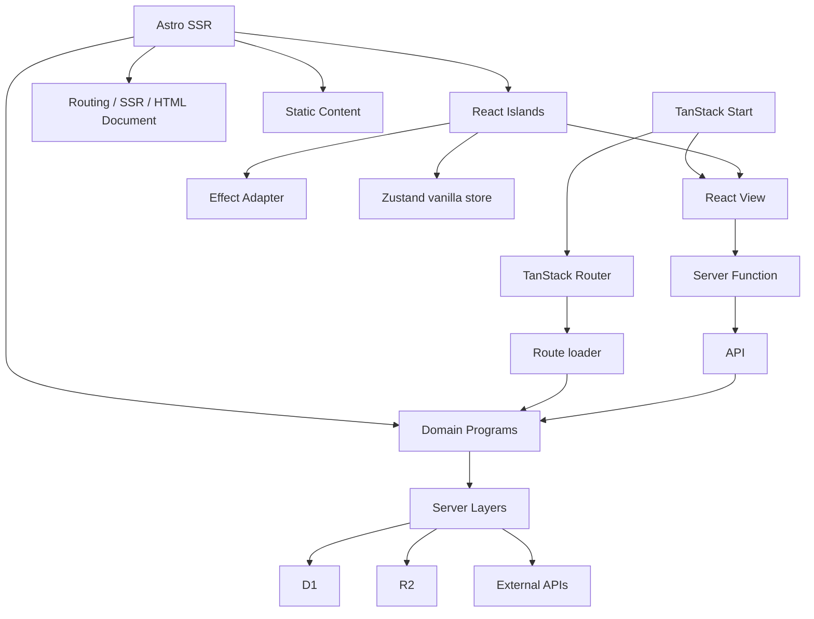
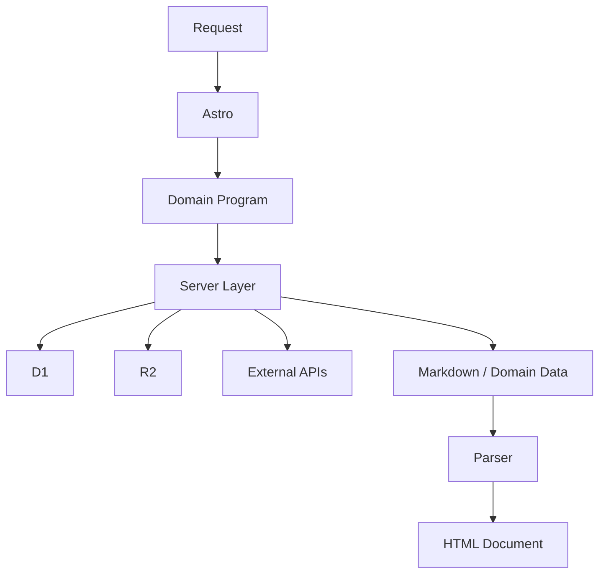
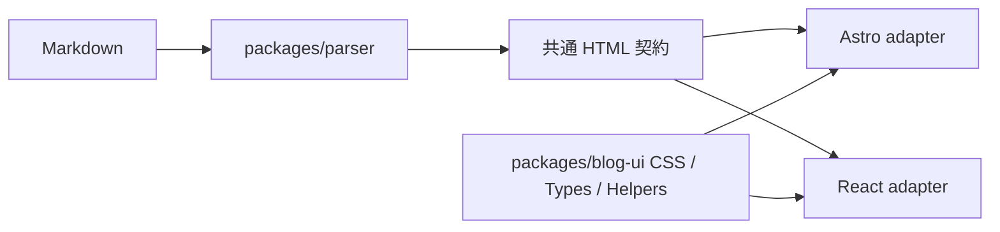
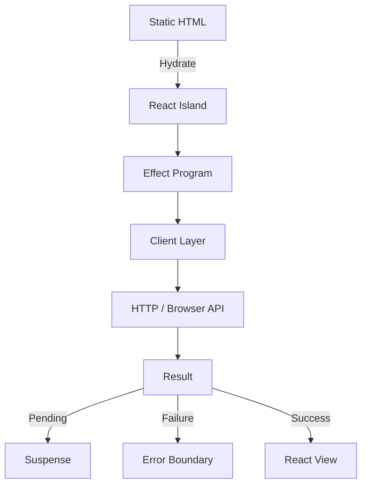
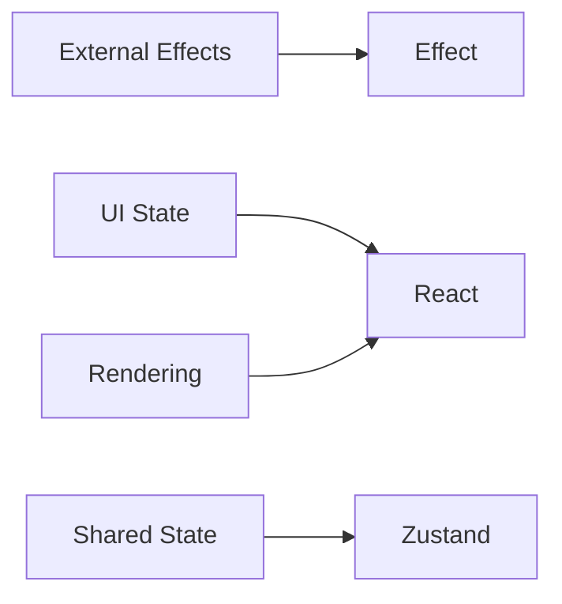

# 実装 Architecture

## 構成



## Repository の責務

| 層                 | 主な責務                                                                           |
| ------------------ | ---------------------------------------------------------------------------------- |
| Domain             | Entity，Value，Use Case，Effect Program                                            |
| API                | HTTP / GraphQL Boundary，認証，入力 Decode，Domain Program の実行                  |
| Web                | Astro Routing，SSR，Document，Island Boundary，Server-side Domain Program の実行   |
| Admin              | TanStack Start / Router のルーティング，SSR，記事管理 UI，API / Domain の Consumer |
| Server Adapters    | D1，R2，外部 API の Effect Layer                                                   |
| `packages/parser`  | Markdown の決定的な変換                                                            |
| `packages/blog-ui` | 記事本文と埋め込みカードの DOM 契約，共通 CSS，表示用の純粋関数                    |
| `packages/ui`      | React Aria ベースの UI primitive                                                   |

## Server の処理



API は HTTP / GraphQL の inbound adapter である．Domain の所有者ではない．記事の正本は Markdown とし，Rendered HTML を Domain Representation にしない．

Web の SSR も，必要な場合は API を経由せず，Domain Program を Server Layer とともに直接実行できる．API と Web は，Domain Program に接続する並列の inbound adapter である．

管理画面は TanStack Start の SSR アプリケーションである．TanStack Router の route tree が URL と画面を型安全に対応付け，route `loader` は表示に必要なデータ取得を担当する．記事の作成・更新・削除や OGP 取得のようなサーバー処理は server function / server route から実行し，React View に秘密情報や API の認証処理を持ち込まない．loader は domain logic の置き場ではなく，Router から Effect Program への inbound adapter とする．

## 記事表示の共有境界

`packages/parser` の `parseArticleToHtml` が記事本文，リンクカード，Twitter プレースホルダーの共通 HTML 契約を生成する．`packages/blog-ui` はその class 名を対象にした唯一の CSS と，Twitter 型・本文分割・日時やメトリクスの整形を提供する．Web と Admin は必ずこの二つを経由し，アプリ固有の記事 CSS や別の Markdown renderer を持たない．

Astro と React のコンポーネント自体は共有しない．Web の `CachedTweet.astro` と Admin の `CachedTweet.tsx` は同じ型，純粋関数，class 名，CSS を使う薄い framework adapter とする．これにより，公開画面は Astro SSR のまま，管理画面は入力に追従する React preview のまま，同じ表示を保つ．



## Client Island の処理



Island は必要な箇所だけに限定する．静的な記事本文，見出し，Metadata は React Runtime を必要としない．

Client Island 内の外部作用は，処理の規模に関係なく Effect Program にする．単純な処理だけを `fetch` や `useEffect` に直接書く例外は設けない．



## Effect と React の Adapter

将来の Adapter は，概念的には次の型を持つ．

```ts
interface ReactM<P, E, R, A> {
  readonly priority: P;
  readonly effect: Effect.Effect<A, E, R>;
}
```

`ReactM` は Effect の代替ではない．担当するのは React の priority，Suspense Bridge，Transition 連携である．

Adapter は Resource の Identity を安定させる必要がある．`render` のたびに新しい Promise や Effect Fiber を無条件に生成しない．

## UI Package の境界

```mermaid
flowchart TD
  Aria[React Aria primitives] --> Package[packages/ui]
  Package --> API[@mimifuwacc/ui]
  API --> Application
```

shadcn はコード生成の起点として使い，生成されたコードは `packages/ui` で管理する．Application は `@mimifuwacc/ui` だけを import し，React Aria の primitive を直接 import しない．`packages/ui` は application-specific type と domain-specific type の両方を import してはならない．`UserId` のような domain primitive も対象に含む．Feature 層で UI 用の primitive または UI 専用 props に変換してから渡す．

## 実装順序

1. Markdown を記事の正本にする．
2. Parser / Renderer を API から分離する．
3. Astro SSR で記事を表示する．
4. TanStack Start / Router で管理画面の route tree と loader を構築する．
5. Repository，Renderer，Cache を Effect Service にする．
6. 操作が必要な部分だけ React Island にする．
7. Island 間の共有が必要な場合だけ Zustand vanilla store を追加する．
8. React Aria ベースの `packages/ui` を整備する．
9. 必要になった時点で Effect と Suspense / Transition の Adapter を追加する．
