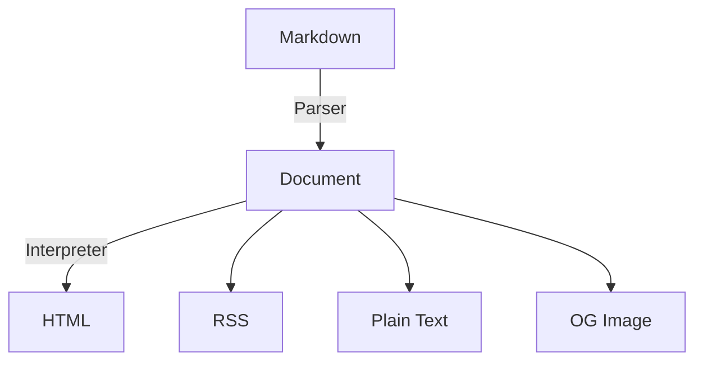
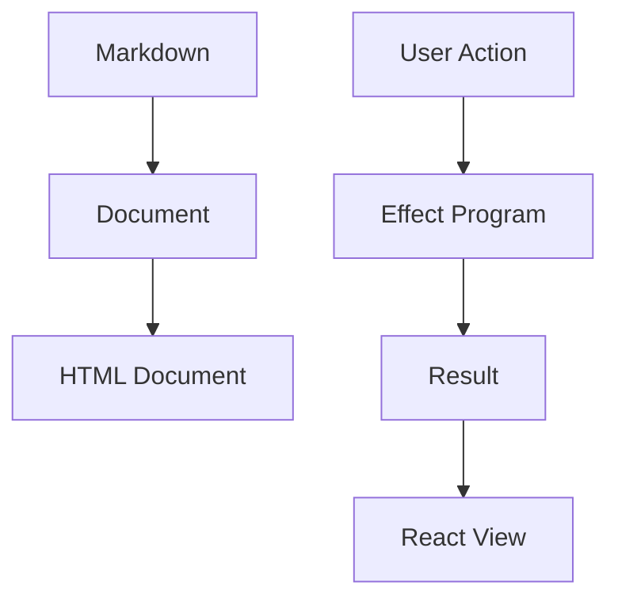

# Content Pipeline

Content は，正本と変換結果を分けて扱う．

記事の正本は Markdown とする．HTML は Markdown から生成する．

初期実装では，Markdown から HTML への決定的な Renderer を必須とする．

$$ Markdown \xrightarrow{Renderer} HTML $$

複数の出力形式が必要になった場合は，次の二段階へ一般化する．Document IR は初期実装の必須要件ではない．

$$ Markdown \xrightarrow{Parse} Document \xrightarrow{Interpreter} Output $$

## Markdown は Source of Truth

Repository が扱う記事は，表示用 HTML ではなく Markdown を返す．

```ts
type BlogPost = {
  slug: string;
  title: string;
  markdown: string;
  publishedAt: Date;
};
```

`content: HTMLString` を記事の正本にしない．HTML を変更しても Markdown の内容は変わらず，Markdown を変更すれば HTML は再解釈できる．

## Renderer の責務

Markdown の Parser / Renderer は，記事を保存する Repository や HTTP，Astro，React を知らない．



Web 用の HTML は出力形式の一つである．

RSS や OGP 画像など別の出力が必要になった場合は，Document IR を導入して Interpreter を追加する．

## Content Program

取得，変換，キャッシュ，失敗を含む処理は Effect Program として記述できる．

```ts
const renderBlogPost = (slug: Slug) =>
  Effect.gen(function* () {
    const posts = yield* BlogRepository;
    const renderer = yield* MarkdownRenderer;

    const post = yield* posts.get(slug);
    return yield* renderer.render(post.markdown);
  });
```

この Program は R2，filesystem，HTTP を知らない．Server Layer が Repository と Renderer を具体的な実装へ解釈する．Test では Memory Layer を与えられる．

## HTML は Derived Artifact

HTML を再生成できるなら，HTML は Source of Truth ではなく Derived Artifact である．必要に応じて，Renderer の結果をキャッシュする．

$$ HTML = Cache(Render(Markdown)) $$

キャッシュは削除・再生成できる．キャッシュの有無が Markdown の正しさや Domain Model に影響してはいけない．

キャッシュキーには，少なくとも次を含める．

$$ key = Hash(Markdown, ParserVersion, RendererVersion) $$

これにより，Markdown，Parser，Renderer のいずれかが変わったときに，派生 HTML の Identity も変わる．

## Server と Client

記事本文のような静的な Content は Server 側で HTML に解釈する．検索，編集，リアクションなどの操作が必要な部分だけが Client Island になる．



Content の正本を Client Store に複製しない．Client 側で保持するのは，操作に必要な局所状態や，複数 Island 間で本当に共有する状態だけにする．

## Twitter Embed Cache

単独行の Twitter 投稿 URL は，Markdown Parser が埋め込み用の placeholder へ変換する．Web は Content API の `GET /embeds/twitter/:id` から投稿データを取得し，Astro Component で HTML を生成する．`widgets.js`，iframe，Client 側からの Twitter API 呼び出しは使用しない．

Content API は，Twitter から最後に正常取得できたレスポンスを D1 の `embed_cache` テーブルに保存する．

- 取得から7日以内ならキャッシュをそのまま返す．
- 7日を過ぎていれば，保存済みのデータを返してからバックグラウンドで更新する．
- 更新に失敗しても，保存済みのデータは削除・上書きしない．
- キャッシュがない投稿を取得できなかった場合だけエラーを返す．

`x-embed-cache` レスポンスヘッダーには，キャッシュの状態に応じて `miss`，`hit`，`stale` のいずれかを設定する．

ローカル DB の作成時と API のデプロイ前には，D1 マイグレーションを適用する．

```sh
vp exec wrangler d1 migrations apply mimifuwacc-blogs --local --config apps/api/wrangler.toml
vp exec wrangler d1 migrations apply mimifuwacc-blogs --remote --config apps/api/wrangler.toml
```
