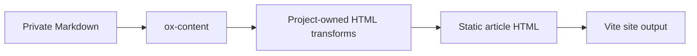

# Content Pipeline

Markdown is the source of truth. HTML is a derived artifact generated during
the static build.



## Content repository

`mimifuwacc/mimifuwa.cc-content` is private. It contains article Markdown
under `articles/` and article assets. Frontmatter is the single publication
boundary:

```yaml
status: draft
```

or:

```yaml
status: published
```

The public repository contains no draft articles. CI checks out the private
repository with a read-only token and removes it after the build.

## Renderer

`ox-content` handles Markdown, GFM, frontmatter, headings, and the base HTML
render. Project-owned transforms are applied after that render for message
cards, link cards, code presentation, and embed placeholders. This keeps the
site-specific parser behavior independent from ox-content's built-in feature
set while retaining ox-content as the SSG engine.

## Embed contract

A standalone Twitter URL becomes a semantic placeholder with the post ID and
`aspect-ratio: 1 / 1`. A link/OGP card has a fixed `aspect-ratio: 1.91 / 1`.
The placeholder is part of the initial HTML, so client enhancement cannot
cause layout shift. The fallback remains useful when JavaScript or an external
metadata request is unavailable.

## Delivery

The site is generated once during CI and deployed as Cloudflare Workers Static
Assets. There is no request-time article API, D1 article store, R2 article
store, or admin server in the public delivery path.
