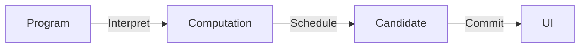

# Architecture

このディレクトリは，mimifuwa.cc の Web Architecture を定義する．

理論的な前提は，[「ReactはUI = f(State)であるか？」](https://wtrclred.io/ja/posts/09) を参照する．

## 文書構成

1. [理論的前提](./01-theoretical-foundation.md)
2. [設計原則](./02-design-principles.md)
3. [実装 Architecture](./03-implementation-architecture.md)
4. [Content Pipeline](./04-content-pipeline.md)

設計判断は [設計原則](./02-design-principles.md) と [実装 Architecture](./03-implementation-architecture.md) に記録する．

## 処理モデル

各層の担当を次のように分ける．

| 層         | 担当する責務                                                          |
| ---------- | --------------------------------------------------------------------- |
| Content    | Markdown を正本として管理する                                         |
| Effect     | Computation，依存性，失敗，Concurrency                                |
| Zustand    | Shared Mutable State                                                  |
| React      | Temporal Rendering，Suspense，Transition，Commit                      |
| React Aria | Interaction，Accessibility，Focus，Keyboard                           |
| CSS        | Visual Presentation                                                   |
| Astro      | Delivery と Composition Boundary。Routing，SSR，HTML Document，Island |
